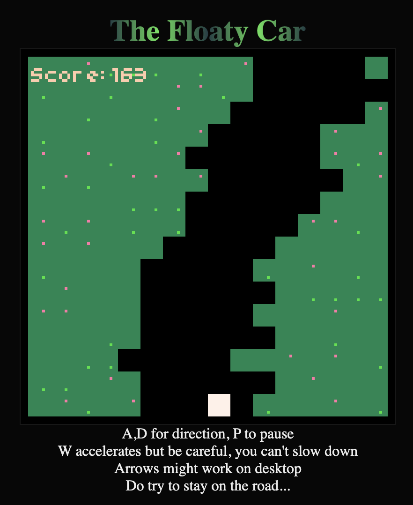

# Floaty Car
A little game written in [Floaty](https://floaty.dev/).

The idea is to steer your car left or right, staying on the road and avoiding
crashing into the sides. You can optionally speed up the car, but remember: You can't slow down!

# You need Bun, hun
I use [Bun](https://bun.sh/) as a JavaScript bundler, it's simple, fast and just works.
